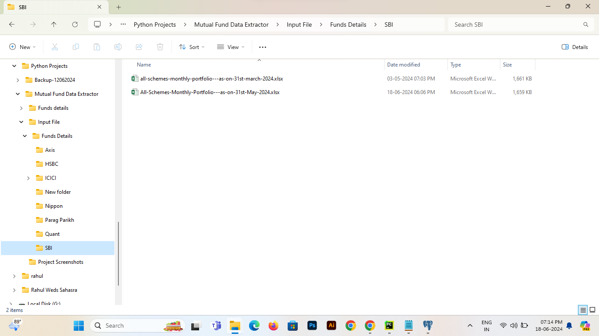

# Mutual Fund Data Extractor
**This process involves downloading stock holding data files from various mutual fund houses and storing them in the database.**

**The process of downloading stock details of funds is automated using Selenium and Python.
Selenium is used to handle the automation of downloading stock data, while Python is employed for data manipulation and ingestion the data into the database.**

### Below are the steps and screenshots demonstrating how the automation process works:

**1. Run the Project**
- Execute the mutual_fund_extractor.py file to initiate the project.

**2. Downloading and Processing Data**

- Nippon Mutual Fund
    - The bot will navigate to the Nippon Mutual Fund website.
      
    - It will download the monthly portfolio file for the previous month.
      
    - The downloaded file will be moved from the default download location to the specified path.
      
    - The file will then be read and its contents are inserted into the database.

- SBI Mutual Fund
    - The bot will navigate to the SBI Mutual Fund website.
    - It selects the appropriate year.
      
    - It chooses the specific month.
      
    - It will download the monthly portfolio file for the previous month.
      
    - The downloaded file will be moved from the default download location to the specified path.
      
    - The file will then be read and its contents inserted into the database.

**3. Data Utilization for Analysis**
- The data collected from Mutual Funds is subsequently used for Mutual Fund Data Analysis.
  - Fund Details table data:
    
  - Stock Details table data:
    

